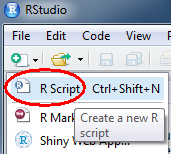
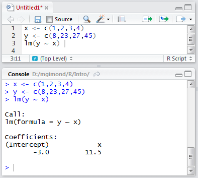
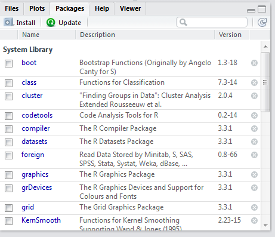
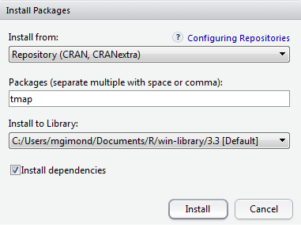
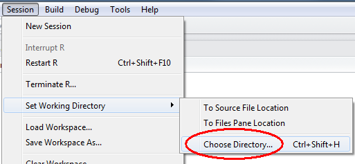

```{r setup, include=FALSE}
knitr::opts_chunk$set(echo = TRUE, prompt=FALSE, message=FALSE, warning=FALSE)
```

# The workhorse: R

[R](http://cran.r-project.org/) is an open source data analysis and visualization programming environment whose roots go back to the [S programming language](https://en.wikipedia.org/wiki/S_%28programming_language%29) developed at Bell Laboratories in the 1970's by [John Chambers](https://en.wikipedia.org/wiki/John_Chambers_%28statistician%29). It's available for most operating systems including Windows and Macs.

You can download the latest version of R for Windows from [https://cran.r-project.org/bin/windows/base/](https://cran.r-project.org/bin/windows/base/) and for the latest version of R for  Mac got to [https://cran.r-project.org/bin/macosx/](https://cran.r-project.org/bin/macosx/)

# The friendly interface: RStudio

[RStudio](https://www.rstudio.com/products/RStudio/)  is an integrated development environment (IDE) for R. It offers a user friendly interface to R by including features such as a source code editor (with colored syntax), data table viewer, git and github integration and markdown output. Note that RStudio is *not needed* to run R (which has its own IDE environment--albeit not as nice as RStudio's) but it makes using R far easier. RStudio is free software, but unlike R, it's maintained by a private entity which also distributes a commercial version of RStudio for businesses or individuals needing customer support.

You can download RStudio from this link [https://www.rstudio.com/products/rstudio/download3/#download](https://www.rstudio.com/products/rstudio/download3/#download)


# Command line vs. script file

## Command line

R can be run from a *R console* or a *RStudio* command line environment. For example, we can assign four numbers to the object `x` then have `R` read out the values stored in `x` by typing the following at a command line:

```{r}
x <- c(1,2,3,4)
x
```

`<-` is refered to as the assignment operator. Operations and functions to the right of the operator are stored in the object to the left.

## R script file

If you intend on typing more than a few lines of code in a command prompt environment, or if you wish to save a series of commands as part of a project's analysis, it is probably best that you type your commands in an a R script file. Such file is usually saved with a *.R* extension. 

You create a new script by clicking on the upper-left icon and selecting *R Script*.



In RStudio, you can run (or *execute* in programming lingo) a line of code of an R script by placing a cursor anywhere on that line (while being careful not to highlight any subset of that line) and pressing the shortcut keys `Ctrl+Enter` (or `Command+Enter` on a Mac).

You can also run an entire block of code by selecting (highlighting) all lines to be run and pressing the shortcut keys `Ctrl+Enter`. Or, you can run the entire R script by pressing `Ctrl+Alt+R`.

In the following example, the R script file has three lines of code: two assignment operations and one regression analysis. The lines are run one at a time using the `Ctrl+Enter` keys and the output of each line is displayed in the console window.



# Packages

One of R's attractive features is its rich collection of packages designed for specific applications and analysis techniques. Packages allow researchers and scientists to share R functions and data with other users. Some packages come already installed with R, others must be downloaded separately from a CRAN repository or other locations such as GitHub or a personal website.

## Base packages
R comes installed with a set of default packages. A snapshot of a subset of the installed base packages is shown below:



## Installing packages from CRAN
There are thousands of R packages to choose from. Most can be accessed from the CRAN repository. To install a CRAN package from within RStudio, click on the *Packages* tab, select *Install* and choose *Repository (CRAN, CRANextra)* as the source location. In the following example, the package *tmap* is installed from CRAN.



Package installation from CRAN's repository can also be accomplished using the following line of code:

```{r eval=FALSE}
install.packages("tmap")
```

The installation is usually straightforward and if any other packages need to be installed, R will install those as well if the *Install dependencies* option is checked. In the previous example, `tmap` requires that more than two dozen or so packages be present on your computer (such as `RColorBrewer` , `sp` and `rgdal`)--all of which are automatically installed.

Note that R packages are installed in the user's home directory (C:/Users/...) by default. This is advantageous in that you do not need to have administrative privileges to install any package. But it can be a disadvantage in that if someone else logs on to the same computer where you installed a package, that person will not have access to it requiring that she install that same package in *her* home directory thereby duplicating an instance of that package on the same computer. 

Packages used in this workshop that you might want to download now are: `tmap`, `rgdal`, `raster`, `rgeos`, `dplyr`. Note that installing `tmap` forced R to install `rgdal`, `raster` and `rgeos` since `tmap` makes use of a subset of their functions, so these packages do not need to be installed explicitly.

## Using a package in a R session

Just because a package is installed on your computer (in your home directory or in a directory accessible to you) does not mean that you have access to its functions in an R session. For example, after installing the `tmap` package you might want to access one of its datasets (`World`) and make use of one of its functions (`qtm`) to generate a choropleth map. This requires that `tmap`'s function be loaded at the beginning of the session using the `library()` function. Here's what happens when you *don't load* the `tmap` package before using its `World` dataset and running its `qtm()` function:

```{r error=TRUE}
data(World) 
qtm(World)
```

To make the functions and/or data of a package available in an R session, use the `library()` function:

```{r fig.width=3, fig.height=2}
library(tmap)
data(World)
qtm(World)
```

# Getting a session's info

Reproducibility is a fundamental idea behind an open source analysis environment such as R. So it's only fitting that *all* aspects of your analysis environment be made available (along with your data and analysis results). This is because functions and programming environments may change in their behavior as versions evolve; this may be by design or the result of a bug in the code fixed in later versions. No pieces of software, open-source or commercial, are immune to this. It's therefore important that you publicize the R session in which parts of or all analyses were conducted. A simple way to do this is to call the `sessionInfo()` function.

```{r}
sessionInfo()
```

Output includes all loaded base packages and external packages (e.g. *tmap* in this working example) as well as their version.

# Exploring vector data

The following exercise assumes that your data files are stored in a folder called `Data` and that the R session working folder is at the the same directory level as the `Data` folder.

You change an R session's working directory via the following pulldown:




You will also need to download and uncompress the data from [https://mgimond.github.io/MEGUG2016/Data.zip](https://mgimond.github.io/MEGUG2016/Data.zip) onto your computer.

## Loading a shapefile

Shapefiles are easy to work with in R. Many packages will read them into an R session including `rgdal`.

```{r}
library(rgdal)
me <- readOGR("./Data", "Income")
```

R stores the contents of the shapefile as a `SpatialPolygonsDataFrame` object in an object called `me` in your current R session.

## Create a simple map

To check that the geometry was properly loaded, use the `qtm` function from the `tmap` package.

```{r fig.height=3}
qtm(me)
```

## Exploring the attributes table

The attributes table can be accessed as follows;

```{r}
me@data
```

The attribute names can be accessed as follows:
```{r}
names(me)
```

There are two attributes (fields) in our table: `NAME` and `Income`. Note that R is case sensitive so when referencing theses field names, you must be mindful of the case.

Let's symbolize the polygons using the `Income` attribute.

```{r fig.height=3}
qtm(me, fill="Income")
```

This is a good first start, but it would be nice to control the color scheme as well as the legend placement.

```{r fig.height=3}
qtm(me, fill="Income", fill.style="quantile", 
    fill.n=4,
    fill.palette="Greens",
    legend.text.size = 0.5,
    layout.legend.position = c("right", "bottom"))
```

Here, we use a *quantile* classification scheme with four classes (`fill.n=4`), a green hue following Cindy Brewer color scheme recommendations, a font size half the size of a default font (`legend.text.size = 0.5`) and a legend placement in the lower right corner of the layout (`layout.legend.position = c("right", "bottom")`).

`tmap` offers us additional control over the layout by breaking up the different mapping elements into individual functions tied together by `+`. If you have used the `ggplot2` package in the past, this approach to tying  mapping elements should be familiar. Here, we customize the legend box, remove the bounding box and place the legend outside of the bounding box.

```{r fig.height=3}
tm_shape(me) + 
  tm_fill("Income", style="fixed", breaks=c(0,23000 ,27000,100000 ),
          labels=c("under $23,000", "$23,000 to $27,000", "above $27,000"),
          palette="Greens")  +
  tm_borders("grey") +
  tm_legend(outside = TRUE, text.size = .8) +
  tm_layout(frame = FALSE)
```

## Joining attribute tables

In this exercise, we'll join a CSV file to the `me` spatial object. First, we'll load the contents of the CSV file into an oject we'll call `dat`.

```{r}
dat <- read.csv("./Data/Crime2012.csv")
```

Next, we'll make use of `dplyr`'s `left_join` function to join the table to the spatial object `me` by county name.

```{r}
library(dplyr)
me@data <- left_join(me@data, dat, by=c("NAME" = "County"))
```

Here, we are accessing the attributes table (stored in the data component) via `me@data`. In essence, the above code is joining the data table `dat` to the attributes table `me@data` and overwriting the existing attributes table in the process. The function is also provided with a join key that dictates which columns from each table are to be used to match the records. Here, we are matching `me`'s `NAME` column to `dat`'s `County` column.

The joined table reports the number of property and violent crimes  within each county. We will create a new *violent crime* rate field (per 100,000) from the violent crime count and population fields.

```{r}
me$Violent_rate <- me$Violent / me$Population * 100000
```

Now let's map the violent crime rate.

```{r fig.height=3}
qtm(me, fill="Violent_rate", fill.style="pretty", title="Violent crimes \nper 100,000", legend.outside=TRUE)
```


# Exploring raster data

## Loading a raster file

Let's load a DEM raster of Maine. We could use the `readOGR()` function for this, but we will make use of another package called `raster`. In addition to reading many raster formats, `raster` has many wonderful map algebra operations capability.

```{r fig.height=3}
library(raster)
dem <- raster("./Data/DEM.img")
```

Let's map the raster.

```{r fig.height=3}
tm_shape(dem) + tm_raster(palette = "Greys", n=8) +
  tm_legend(outside = TRUE, text.size = .8)
```

Note the use of the `tm_shape` function. The word *shape* does not refer to a shapefile but references the feature to be mapped (vector or raster).

## Creating a hillshade

In this example, we make use of `raster`'s `hillshade` function to create a hillshade rendering of the DEM. This requires that we first create a slope an aspect raster from the data using the `terrain` function.

```{r fig.height=3}
slope  <- terrain(dem, opt='slope')
aspect <- terrain(dem, opt='aspect')
hill   <- hillShade(slope, aspect, 40, 270)
tm_shape(hill) + tm_raster(palette = "Greys", style="cont", contrast = c(0,.8)) +
  tm_legend(show=FALSE) 
```

We can clip/mask the hillshade raster to the Maine polygon outline using the `mask` function (equivalent to the *Extract by Mask* tool in ArcGIS).

```{r fig.height=3}
hill_me <- mask(hill, me)
tm_shape(hill_me) + tm_raster(palette = "Greys", style="cont", contrast = c(0,.8)) +
  tm_legend(show=FALSE) 
```

## Overlaying raster layers with vector layers

The `tmap` package allows you to overlay different features by simply appending `tm_` functions. In the following example, we map `me` then overlay it with a semi-transparent rendering of the hillshade.

```{r fig.height=3}

tm_shape(me) + 
  tm_fill("Income", style="fixed", breaks=c(0,23000 ,27000,100000 ),
          labels=c("under $23,000", "$23,000 to $27,000", "above $27,000"),
          palette="Greens")  +
  tm_borders("grey") +
  tm_legend(outside = TRUE, text.size = .8) +
  tm_layout(frame = FALSE) +
  tm_shape(hill_me) + tm_raster(palette = "Greys", style="cont", 
                                contrast = c(0,.8), alpha=0.4, 
                                legend.show = FALSE) 
```


# Vector data manipulation

## Dissolving on a variable

Let's create a binary vector layer where a value of `1` is assigned to all counties having a value greater than `$23,000` and a value of `0` for those below that amount. We'll create a new column called `Cutoff` to store this value.

```{r fig.height=3}
me$Cutoff <- ifelse( me$Income > 23000, 1, 0)
qtm(me, fill="Cutoff", fill.style="cat")
```

In the above example, we force the numeric values to categorical values with the call to `fill.style="cat"`. This is done to prevent `qtm` from attempting to created *ranges* of value such as -0.5 to 0.5 and 0.5 to 1.5.

Next, we'll dissolve the polygons based on the `Cutoff` value using `raster`'s aggregate function.

```{r fig.height=3}
me_dis <- aggregate(me, by="Cutoff")
qtm(me_dis, fill="Cutoff", fill.style="cat")
```

## Transforming coordinate systems

In this example, we'll load a point layer representing Augusta whose coordinate pair is stored in a geographic (lat/long) coordinate system. We'll then project it into a UTM NAD83 Zone 19N coordinate system.

```{r}
Aug_ll <- readOGR("./Data", "Augusta_ll")
```

To extract the coordinate system information type,

```{r}
proj4string(Aug_ll)
```

Coordinate systems are defined in R using a syntax created by the [PROJ4](http://proj4.org/) project. It consists of a list of parameters, each prefixed with the `+` character. For example, `Aug_ll`'s CS is in a lat/long coordinate system (`+proj=longlat`) built on a  WGS 1984 datum  (`+datum=WGS84`) which is itself built on top of a WGS84 ellipsoid.

To change the coordinate system, we must create the projection string. There are several options. If you know the EPSG index for your coordinate system, you can reduce the coordinate string to `+init=epsg:26919` as in,

```{r}
Aug_UTM <- spTransform(Aug_ll, CRS("+init=epsg:26919"))
```

If you don't have the EPSG value or would rather manually define the coordinate system, you could use the following syntax:

```{r}
Aug_UTM <- spTransform(Aug_ll, CRS("+proj=utm +zone=19 +datum=NAD83 +units=m +no_defs +ellps=GRS80 +towgs84=0,0,0"))
```

Note that the `proj4string` and `spTransform` functions are part of the `sp` package. We did not need to manually load this package since it was automatically loaded when we loaded the `rgdal` package earlier in this exercise.

The `CRS` projection string is very versatile--allowing you to customize your own projection. For a comprehensive list of projection types and parameters, visit the [proj4.org](http://proj4.org/) website.

## Example: Calculating average income as a distance from Augusta

First, we'll buffer the Augusta point using three different distances: 100km, 200km and 300km. Note that the map units are in meters which will require that we encode the distances in meters and not kilometers. We'll make use of `raster`'s `buffer` function.

```{r fig.height=3}
d100 <- buffer(Aug_UTM, width=100000, quadsegs=10)
d200 <- buffer(Aug_UTM, width=200000, quadsegs=10)
d300 <- buffer(Aug_UTM, width=300000, quadsegs=10)

# Let's check the circles on a Maine outline
tm_shape(d300) +tm_borders() +tm_shape(d200) +tm_borders() + tm_shape(d100) +tm_borders() +tm_shape(me) +tm_borders()
```

The `quadsegs=10` parameter defines the number of line segments to use per quarter circle. In our example, we are using 10 segments per circle for a total of 40 line segments.

Next, we will combine the circles to create a single layer defining the different annuli using the `union` function. We will do this twice since the function can only accept two layers at a time.

```{r}
dAll <- union(d200, d100)
dAll <- union(d300, dAll)
```

Not that the union operation will not allow polygons to overlap so any overlapping area of the polygons are merged into a single one.

The output of the `union` operation did not create an attributes table. We will therefore create one by add an id value (`1` thorugh `3`) to the polygons.

```{r}
dAll$ID <- 1:length(dAll)
```

Next, we will clip the distance bands to the state of Maine (this will be important for subsequent steps).

```{r}
dAllme <- crop(dAll, me)
```

Next, we'll compute the area in each bacd using the `gArea` function from the `rgeos` package.

```{r}
library(rgeos)
dAllme$Area_band <- gArea(dAllme, byid=TRUE) / 1000000 # Compute area in km2
```

Let's map the distance bands

```{r fig.height=3}
qtm(dAllme, fill="Area_band") 
```

Next we'll intersect the distance bands with the income layers.

```{r fig.height=3}
clp1 <- intersect(me, dAllme)
tm_shape(clp1) + tm_fill(col="Income") + tm_borders()
```

Next, we'll compute the area for each polygon in this new layer.

```{r}
clp1$Area_sub <- gArea(clp1, byid=TRUE) / 1000000
```

Each polygon now has two area attributes: the area associated with the distance band and each polygon that was created from the intersection between the income layer and the distance band layer. The next step is to calculate the fraction of the distance band area covered by the polygon, then to weigh each polygon's income value using that fraction.

```{r}
# Compute the polygon's fraction vis-a_vis the distance band's area
clp1$frac_area <- clp1$Area_sub / clp1$Area_band

# Mutiply income by area fraction--this is the weighted income 
# within each distance band
clp1$wgt_inc <- clp1$Income * clp1$frac_area
```

Finally, we will dissolve all polygons (using the `aggregate` function) by distance band and sum the weighted income values to give us average income values per distance.

```{r fig.height=3}
dist_inc <- aggregate(clp1, by="ID",sums= list(list(sum, "wgt_inc")))
qtm(dist_inc, fill="wgt_inc") 
```

# Additional resources

+ This workshop is available online at [https://mgimond.github.io/MEGUG2016/Tutorial.html](https://mgimond.github.io/MEGUG2016/Tutorial.html).
+ I have additional *GIS with R* tutorials in the Appendix of my ES214 course site at [https://mgimond.github.io/Spatial](https://mgimond.github.io/Spatial). The Appendix also offers an extensive write-up on (raster) map algebra operations in R; this includes local, focal, zonal ang global operations.
+ For a general introduction to R and basic (aspatial) data manipulation and visualization you might want to skim through my *Exploratory Data Analysis with R* course page: [https://mgimond.github.io/ES218](https://mgimond.github.io/ES218/index.html).
+ To stay abreast of new spatially related packages in R, follow Roger Bivand's *CRAN Task View* at [https://cran.r-project.org/web/views/Spatial.html](https://cran.r-project.org/web/views/Spatial.html)
+ I know of only one book dedicated to GIS data manipulation in R: *An Introduction to  R for Spatial Analysis & Mapping* by Chris Brunsdon and Lex Comber. The authors make use of another R package called `GISTools`. Chris Brunsdon also offers an online course in GIS data manipulation in R on the *Statistics.com* website.
+ If you are interested in spatial analysis and statistics, you will want to check out *Applied Spatial Analysis with R* by R. Bivand, E. Pebesma and V. Gomez-Rubio. They make heavy use of a package called `sp`.
